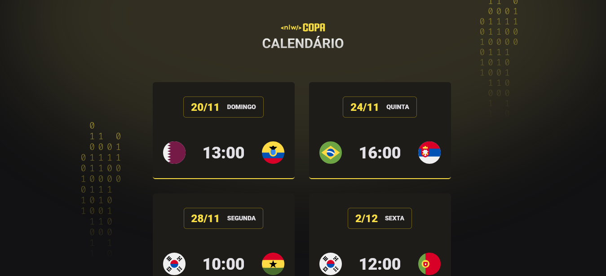

<h1 align="center"> NLW #10 Copa</h1>

  <a href="#tecnologias">Tecnologias</a>&nbsp;&nbsp;&nbsp;|&nbsp;&nbsp;&nbsp;
  <a href="#projeto">Projeto</a>&nbsp;&nbsp;&nbsp;|&nbsp;&nbsp;&nbsp;
  

## Tecnologias
Esse projeto foi desenvolvido com as seguintes tecnlogias:

- HTML
- CSS
- Javascript
- Git e Github.

## Projeto

O calendário da Copa é um projeto que mostra os jogos da Copa do Mundo de 2022.

<h2 align="center">
<a href="https://mariaeduarda-deoliveira.github.io/nlw-copa-explorer/">Veja o projeto aqui!</a></h2>

## Créditos do projeto!

O layout todo é da Rocketseat em seu evento NLW. Todos os créditos vão para eles.

